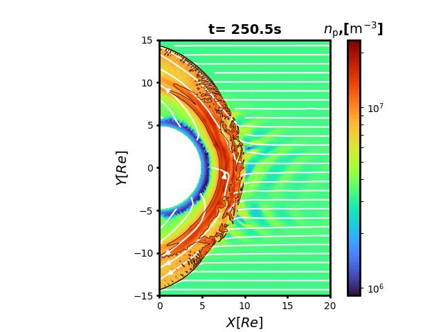

# Examples

## Loading VLSV data

- Read meta data
```
filename = "bulk.0000004.vlsv"
meta = readmeta(filename)
```

This VLSV meta data contains information of file names, variable names, cell ID list, mesh sizes and populations, which can then be passed into all kinds of methods that process the data. 

- Read variable meta data
```
readvariablemeta(meta, "proton/vg_rho")
```

A list of utility functions has been implemented for checking variable status. See [here](https://henry2004y.github.io/Vlasiator.jl/dev/internal/#Vlasiator.hasname-Tuple{Any,%20Any,%20Any}) for the full list. 

- Read variable
```
data = readvariable(meta, "proton/vg_rho")
```

The variable reading is designed for cells, which takes cell ID(s) as inputs, although the same interface works for both DCCRG grid and FS grid variables. By default the returned DCCRG grid variable array is sorted by cell IDs. If in any case you want the original unsorted version as being stored in the file, use `readvariable(meta, var, false)`.

- Get variable at a given location
```
loc = [2.0, 0.0, 0.0]
id = getcell(meta, loc)
readvariable(meta, "proton/vg_rho", id)
```

- Get variable along a line between two points
```
Re = Vlasiator.Re # Earth radii
point1 = [12Re, 0, 0]
point2 = [15Re, 0, 0]
cellids, distances, coords = getcellinline(meta, point1, point2)
rho_extract = readvariable(meta, "proton/vg_rho", cellids)
```

- Compare VLSV files

One may want to check if two vlsv files are identical. This is tricky because
1. the structure of VLSV format does not guarantee parallel writing order;
2. numerical error accumulates with floating point representation.

The key is that we should not check quantities that are related to MPI writing sequence: for some reasons, even file sizes may vary depending on the number of MPI processes!

```
issame(filename1, filename2)
```

There is an optional third argument to `issame` for setting the relative difference tolerance, with default being 1e-4.
In practice relative difference works better for "large" numbers, and absolute difference works better for "small" numbers.


More examples can be found in the [repo](https://github.com/henry2004y/Vlasiator.jl/tree/master/examples).

## Computing derived quantities

Vlasiator is capable of computing moments and some derived quantities and save them directly into VLSV files.
More derived quantities computed from the saved quantities are also available in postprocessing, such as plasma β, velocity parallel/perpendicular to the magnetic field, pressure tensor with the third axis aligned with the magnetic field direction and so on.
To avoid confusion about variable names, the convention here is that
* if it is directly stored in the VLSV file, read the raw data;
* otherwise check the availability in the derived variable list. All predefined names start with a capital letter.

To obtain a derived quantity, for example,
```
beta = readvariable(meta, "Beta")
```

Here is a full list of available quantities[^1]:

| Derived variable name | Meaning                          | Required variable[^2] |
|-----------------------|----------------------------------|-----------------------|
| Bmag                  | magnetic field magnitude         | vg\_b\_vol            |
| Emag                  | electric field magnitude         | vg\_e\_vol            |
| Vmag                  | bulk speed                       | vg\_v                 |
| VS                    | sound speed                      | vg\_ptensor\_diagonal; vg\_rho |
| VA                    | Alfvén speed                     | vg\_rho; Bmag         |
| MA                    | Alfvén Mach number               | Vmag; VA              |
| Vpar                  | bulk velocity $\parallel\mathbf{B}$| vg\_v; vg\_b\_vol   |
| Vperp                 | bulk velocity $\perp \mathbf{B}$ | vg\_v; vg\_b\_vol     |
| P                     | scalar thermal pressure          | vg\_ptensor\_diagonal |
| Ppar                  | pressure $\parallel\mathbf{B}$   | vg\_ptensor\_diagonal; vg\_b\_vol |
| Pperp                 | pressure $\perp \mathbf{B}$      | vg\_ptensor\_offdiagonal; vg\_b\_vol |
| T                     | scalar temperature               | P; vg\_rho            |
| Tpar                  | temperature $\parallel\mathbf{B}$| vg\_rho; vg\_ptensor\_diagonal; vg\_b\_vol |
| Tperp                 | temperature $\perp \mathbf{B}$   | vg\_rho; vg\_ptensor\_offdiagonal; vg\_b\_vol |
| Protated              | pressure tensor with $\widehat{z} \parallel \mathbf{B}$ | vg\_b\_vol; vg\_ptensor\_diagonal; vg\_ptensor\_offdiagonal |
| Anisotropy            | $P_\perp / P_\parallel$          | ptensor; B            |
| Pdynamic              | dynamic pressure                 | vg\_rho; Vmag         |
| Poynting              | Poynting flux                    | E; B                  |
| Beta                  | plasma beta, $P / P_B$           | P; vg\_b\_vol         |
| IonInertial           | ion inertial length              | vg\_rho               | 
| Larmor                | Larmor radius                    | Vperp; Bmag           |
| Gyrofrequency         | ion gyroperiod                   |                       |
| Plasmaperiod          | plasma oscillation period        |                       |

which can also be found as keys of dictionary in [vlsvvariables.jl](https://github.com/henry2004y/Vlasiator.jl/tree/master/src/vlsv/vlsvvariables.jl).

[^1]: For species specific variables, you need to add the species name at the front, separated by a slash. For example, the proton bulk velocity is a string `proton/vg_v`.
[^2]: If a required variable exists in the VLSV file, we try to use it directly instead of calculating from other variables. The interpolated FS grid variables onto DCCRG grid are preferred over original FS grid variables.

!!! note
    In Vlasiator, the cells inside the inner boundary (which is usually a sphere/circle) are filled with zero density values. This is then used to identify the inner boundary for all other quantities. Therefore, if you are manipulating directly on data, make sure that the nonsense values inside the inner boundary are excluded. One way to do this can be found in [vlsvvariables.jl](https://github.com/henry2004y/Vlasiator.jl/blob/master/src/vlsv/vlsvvariables.jl).

!!! warning
    This part has not been carefully tested so it might not work or just generate wrong results. Contributions from users are warmly welcomed!

## Plotting

Vlasiator.jl does not include any plotting library as explicit dependency, but it offers plotting functionalities once the target plotting package is used.

Currently I would recommend using `PyPlot.jl`.
`Plots.jl` is catching up, but it is still slower and lack of features.
`Makie.jl` will be supported in the future if 3D plotting is necessary.

More examples of customized plots can be found in the [repo](https://github.com/henry2004y/Vlasiator.jl/tree/master/src/examples).

### PyPlot Backend

To trigger the Matplotlib plotting, `using PyPlot`.
All the functions with identical names as in Matplotlib accept all possible keyword arguments supported by their Matplotlib counterparts, e.g. font width, font size, colormap, etc.

!!! note
    The method call to certain axes is not dispatched, e.g. `ax.plot`; as an alternative, one needs to pass `ax` as the third argument to the functions, e.g. `plot(meta, "rho", ax)`!

- Scalar colored contour for 2D simulation
```
pcolormesh(meta, "rho")
```

- Vector z component colored contour for 2D simulation in a manually set range
```
pcolormesh(meta, "rho", op=:z, colorscale=Log, axisunit=RE, vmin=1e6, vmax=2e6)
```

- Derived quantity colored contour for 2D simulation (as long as the input variable is in the predefined dictionary)
```
pcolormesh(meta, "b", op=:z, colorscale=Linear, axisunit=SI)
```

- Streamline for 2D simulation
```
streamplot(meta, "rho_v", comp="xy")
```

- Quiver for 2D simulation
```
quiver(meta, "rho_v", comp="xy")
```

The `comp` option is used to specify the two vector components.

!!! note
    Currently there is limited support for derived variables. This will be expanded and changed later for ease of use!

You can choose to use linear/log color scale via `colorscale=Linear` or `colorscale=Log`, plot vector components via e.g. `op=:x` or magnitude by default, and set unit via `axisunit=RE` etc..

- Mesh denoted by cell centers
```
plotmesh(meta; projection="z", color="w")
```

- Cut slice colored contour for 3D simulation
```
pcolormesh(meta, "proton/vg_rho", normal=:y, origin=0.0)
```

- Velocity distribution function near a given spatial location `coordinates = [0.0, 0.0, 0.0]`
```
plot_vdf(meta, coordinates)
```

- Extracted quantity line plot:
```
rho_extracted = vec(rho_extracted)
loc = range(x1, x2, length=length(rho_extracted))
plot(loc, rho)
```

### Plots Backend

To trigger the Plots package plotting, `using Plots`.
This backend supports all available attributes provided by [Plots.jl](http://docs.juliaplots.org/latest/). By default it uses [GR](https://gr-framework.org/), but a wide range of other options are also presented.

- Scaler colored contour for 2D simulation
```
heatmap(meta, "rho", aspect_ratio=:equal, c=:turbo)
```

- Scaler colored contour with lines for 2D simulation
```
contourf(meta, "rho)
```

### Gallery

* Proton density in advection flow with points denoting cell centers


* Proton density of Earth's magnetosphere in the meridional plane from 3D simulation


* Proton density of Earth's magnetosphere in the equatorial plane from 2D simulation, zoomed in to the magnetosheath and foreshock region, with streamlines and density contour at 1e7


* Proton density of Earth's magnetosphere in the meridional cut from 2D simulation, with fieldlines through fixed seeding points


* Proton density of Earth's magnetosphere in the normal cut planes from 3D simulation


* Proton phase space distribution


## Converting to VTK

We can convert VLSV files into VTK files! Since DCCRG is Cartesian based with uniform spacing, each level of refinement corresponds to a VTK image file, and the cell refinement relationships are defined by `vtkGhostType` as well as the `vthb` file.

To convert a VLSV file into VTK,
```
write_vtk(filename)
```
This function accepts both file names and file meta.

To see the full list of options, please refer to the documentation in [internal](internal.md). Demo usage can be found [here](https://github.com/henry2004y/Vlasiator.jl/blob/master/examples/demo_convert2vti.jl).

!!! warning
    As of ParaView 5.9.1, there are [display issues](https://discourse.paraview.org/t/vthb-file-structure/7224) with `VTKOverlappingAMR`. However, we can read the generated image files directly. There is also an keyword argument for `write_vtk` called `vti`: when it is set to `true`, then only the image file at the highest refinement level is generated.
    This part is experimental and subject to change in the future.

## Tracking log files

We can monitor the runtime performance per iteration through log files:
```
file = "logfile.txt"
timestamps, speed = readlog(file)
```

See a live example at [demo_log.jl](https://github.com/henry2004y/Vlasiator.jl/tree/master/examples/demo_log.jl).

## Calling from Python

It is possible to call this package directly from Python with the aid of [PyJulia](https://pyjulia.readthedocs.io/en/latest/).
Following the installation steps described in the manual[^3], and then inside Python REPL:
```
# Handling initialization issue for Conda
from julia.api import Julia
jl = Julia(compiled_modules=False)

from julia import Vlasiator
filename = "bulk1.0001000.vlsv"
meta = Vlasiator.readmeta(filename)
var = "proton/vg_rho"
data = Vlasiator.readvariable(meta, var)
```

To run a Julia script in Python,
```
# Handling initialization issue for Conda
from julia.api import Julia
jl = Julia(compiled_modules=False)
jl.eval('include("examples/demo_2dplot_pyplot.jl")')
import matplotlib.pyplot as plt
plt.show()
```

!!! note
    This approach is for you to have a taste of the package with a Python frontend. The workaround shown above for handling the static python libraries makes it slow for regular use. An alternative solution would be creating system images, but as of Julia 1.6 the user experience is not smooth. For better integrated experience with its full power, I recommend using the package inside Julia.

[^3]: For Debian-based Linux distributions, it gets a little bit tricky. Please refer to [Troubleshooting](https://pyjulia.readthedocs.io/en/latest/troubleshooting.html) for details.